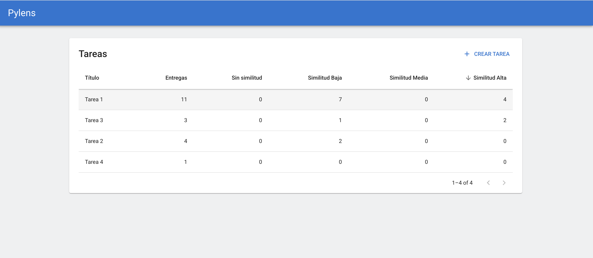
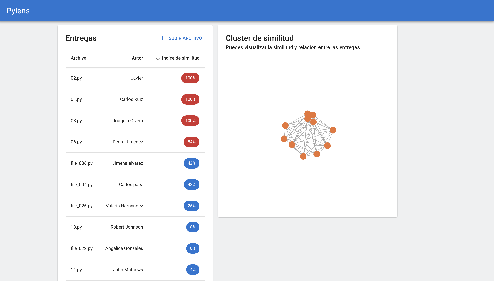
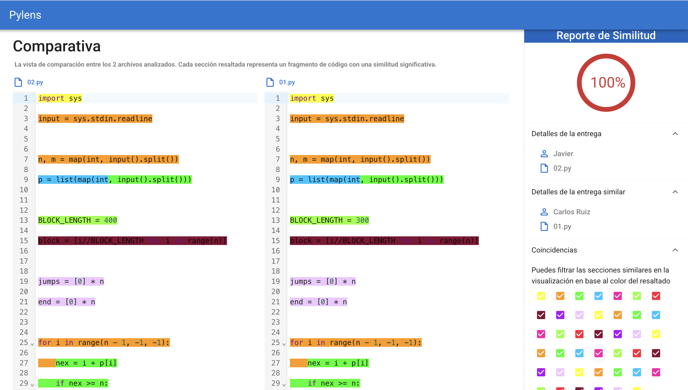
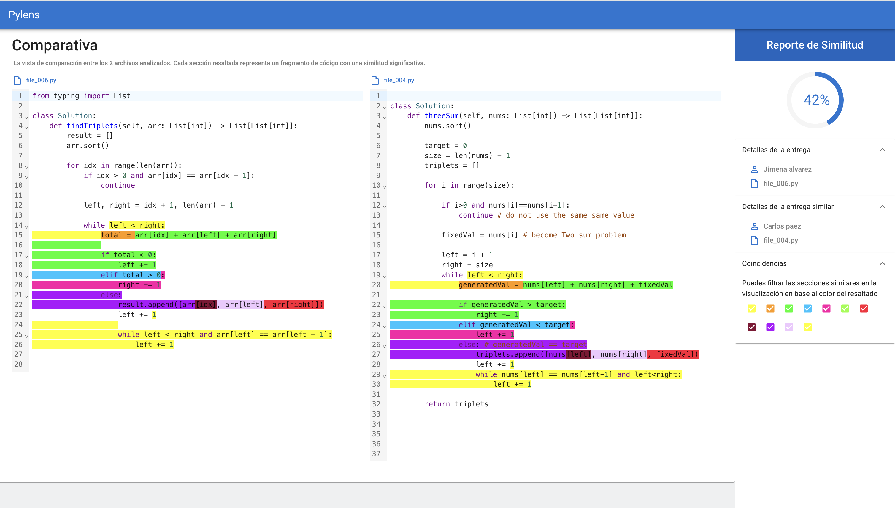
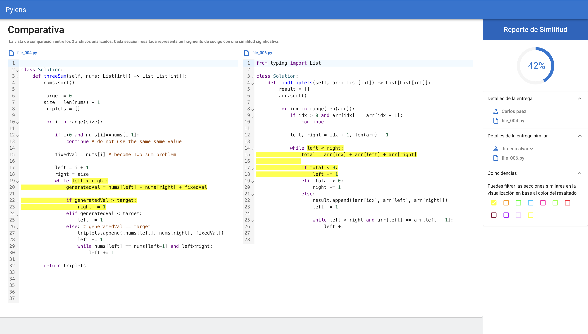

# Pylens

## Introduction

Pylens, is web application 
made for teachers to detect plagiarism in student python code submissions. 

## Methodology

 The core algorithm utilizes k-grams and winnowing: it breaks down code into sliding windows of tokens (k-grams), generates a set of hashes using modulo operations to create fingerprints, and then computes similarity scores using the Jaccard index. This method efficiently identifies overlapping patterns while minimizing false positives. For a deeper dive into the underlying research, refer to the [research paper](assets/Evidencia_1__Análisis_de_similitud_empleando_Inteligencia_Artificial.pdf).

## Features

- **Homework Management**: Create and list homework assignments.
- **Submission Handling**: Students can submit code, and educators can view and analyze them.
- **Code Similarity Detection**: Visualize clusters of similar files using a directed force graph powered by Three.js, along with diff viewers.
- **Code Viewer**: Provides a side-to-side comparison of the most similar pair of documents, with highlighting of similar parts that can be enabled or disabled.
- **Code Editor with Decorations**: Highlight similar code sections in an integrated editor.
- **Firebase Integration**: For authentication and data storage.

## Technologies Used

- **Frontend**: Next.js, React, TypeScript
- **Backend**: Firebase
- **UI Components**: Custom components for tables, graphs, dialogs, and code editors
- **Other**: CodeMirror for code editing, Three.js for force graphs, various libraries for diff viewing and animations

## Screenshots

### Dashboard


### Homework List


### Submission View






## Getting Started

### Prerequisites

- Node.js (v14 or later)
- npm or yarn

### Installation

1. Clone the repository:
   ```
   git clone https://github.com/Carlos24Rz/code-similarity-ui.git
   cd code-similarity-ui
   ```

2. Install dependencies:
   ```
   npm install
   ```

3. Set up environment variables:
   - Create a `.env` file in the root directory.
   - Add your Firebase configuration (see `src/utils/firebase.ts` for required keys).

4. Run the development server:
   ```
   npm run dev
   ```

Open [http://localhost:3000](http://localhost:3000) with your browser to see the result.

## Deployment

The easiest way to deploy this Next.js app is to use the [Vercel Platform](https://vercel.com/). For more details, check out the [Next.js deployment documentation](https://nextjs.org/docs/deployment).

## Learn More

- [Next.js Documentation](https://nextjs.org/docs)
- [Firebase Documentation](https://firebase.google.com/docs)

Contributions are welcome! Feel free to open issues or submit pull requests.
